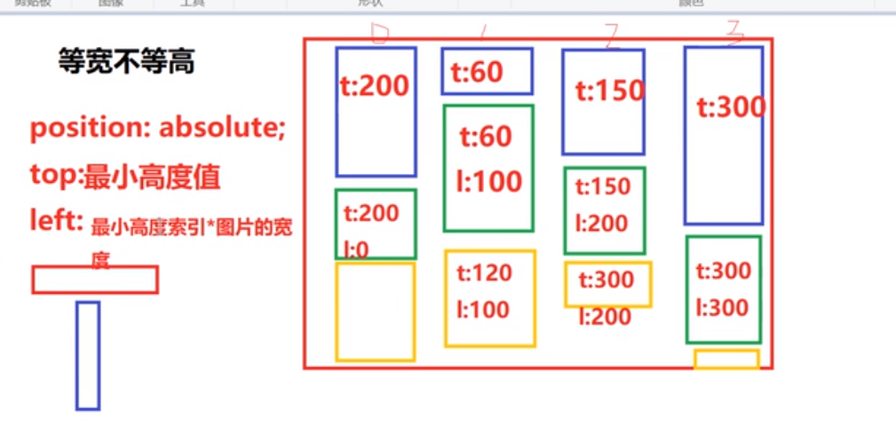

# js 和 es6的关系

>1. ECMAScript是一种规范
>2. js是对于这个规范的实现
>3. TS 是 js的超集
>4. babel转码器 es6转为浏览器识别的css
>

# let const 和 var的区别
1. let const 不存在变量提升
```js
console.log(x) //undefined
var x = 100;

console.log(x) //报错,x is not defiend
let x = 100;

```
2. let const 不能再同一作用域下定义相同的一个变量名称
```js
let c = 10;
let c = 999;
console.log(c) //报错,c has already been declares

var c = 10;
var c = 999;
console.log(c)  //999

const c = 10;
c = 999;
console.log(c); //报错
```
3. let const 有严格的作用域,块级作用域
 作用域(全局作用域,局部作用域)
```js
function f(){
	var a =100;
	if(true) {
		var a = 1000;
	}
	console.log(a)
}
fn();  //1000

function f(){
	let a =100;  //块级作用域{}
	if(true) {
		let a = 1000;
	}
	console.log(a)
}
fn();  //100
```
4 . const 和 let 的不同
	- const声明一个只读的常量
	- 一旦定义不能再修改
	- 引用类型数据可以改变,因为共享同一块内存
```js
const arr = [1];
arr.push(3);
console.log(arr) //1.3
```
# 箭头函数
这是函数的一种语法糖,建华路函数的定义.
箭头函数没有原型对象

# set map数据结构
对象 数组
set 类似于数组,但是她的成员是唯一的
```js
var s = new Set();
set.add(1);
set.add(3);

//set中的链式写法
set.add(3).add(5).add(6) 

var a = [1,2,3,4,5,1,2,3,4];
var s = new Set(arr); //{1,2,3,4,5} 返回的快捷键
```
一个面试题,数组去重
```js
const arr = [1,2,3,1,2,3,4,5,6,4]
var newArr = [...new Set(arr)];

//...运算符
var a6 = [1,2,3];
var a1 = ...a6 //1,2,3
```

map 类似于对象,键值对的方式
```js
let m = new Map();
m.set('name':'why').set('age',18)
//二维数组的形式
let m2 = new Map([''name':'why'
'],['a':'a'])
```

map和对象的区别
1. map的键可以为任意的其他类型
2. 使用for of循环非常方便for(ket [k,v] of obj)

# this的指向规则
一句话总结this :
**this 谁调用指向谁**
```js
var length = 100
function f1() {
	consoe.log(length);
}
f1();   //普通的函数,默认是window
```

```js
function f2() {
	console.log(this);
}
var arr = [f2,100,1000];
arr[0]()  //指向数组
```

## 阿里面试题
```js
var length = 100;
function f1() {
	console.log(this.length);
}
var obj = {
length: 10,
f2 : function(f1) {
	f1();
	arguments[0]();  //指向arguments,拿到arguments的产股值
	}
}
obj.f2(f1,1);  
//100
//2
```
# 理解arguments
```js
function foo() {
	console.log(arguments.length); //5
console.log(arguments[0]) //1
}

f3(1,2,3,4,5)
```

## 第二个案例
```js
var a = 10;  //全局变量
function test() {
	a = 100;
	console.log(a);  //100
	console.log(this.a); //10
	var a; //局部变量
	//这个结果还要再分析
	console.log(a); //100
}
test();

解析过程:  变量 函数(var function)
a : undefined;
test : function();

a = 10;

```
## 案例3
```js
var a = 10;
function f1() {
	var b = 2*a;
	var a = 20;
	var c = a+1;
	console.log(b);  //NaN
	console.log(c);   //21
}
f1();
```
全局变量和局部变量同名的时候:
>一旦同名,对应的全局变量是不会作用于同名局部变量的作用域的


# 瀑布流布局

三个条件
1. 图片居中不变形
2. 图片满屏不留白
3. 图片尺寸不固定

## 瀑布流的特点
等宽不等高

## 实现规律
第一排正常摆放
然后找出里面高度最小的值,将图片放在高度最小值的地方.



```js
function waterFull() {
var img = document.qs('img')
	//1.求出列数,浏览器宽度/图片宽度(向下取证);
	let ImgWidth = img.width();
	let screenWidth = 屏幕宽度
	let cols = parseInt(screen/ImgWidth);
	//2. 创建一个数组,存图片的高度值
	var heightArr = [];
	//遍历所有图片
	for(let i = 0 ; i < img.length;i++) {
	//判断是不是第一行图片
	var imgHeight = img[i].height();
	if(i < cols) {
		heightArr.push(imgHeight)
	}else {
	//最小高度值
	var minHeight = Math.min(...imgheight);
	//最小高度的索引
	var minIndex = Math.min(imgArr.findIndex(item) => item === min)
		//第二行开始要对图片进行定位
		$(item).css {
			postion : 'absolute',
			top :minHeight + 'px', //'最小高度'
			left:minIndex * imgWidth + 'px'  //最小高度索引*imgWidth + 'px'
		}
		//3. 更新最小高度的值
		heightArr[最小高度的索引值] += imgHeight;
	}
	}
}
```


# 求出数组中最小值的办法
## 方案一 循环
```js
var arr = [34,56,21,95];

//定义一个最小值
var min = arr[0]

//对当前数组循环遍历
arr.forEach((item) => {
	item < min ? item : min
})
```
## 利用Math.min方法
```js
var arr = [34,56,21,95];
var min = Math.min(...arr);
console.log(min)
```
## 扩展,求出最小值的索引 findIndex
```js
//findIndex() 满足条件第一个元素的位置
var Index = arr.findIndex(item > item == min)
```

# vue实现省市区联动功能
```js
window.onload = function() {
	new Vue({
		el : '#app',
		data :{
			arr : [], //全部数据
			prov : '北京', //默认情况下选中北京
			cityArr : [],
			city : '' //当前市对应的数据
			areaArr : [] //存放区数据
			area : '' //当前区默认数据
		},
		methods : {
			getData : functiom() {
				axios({
					method :'get',
					url : 'http://127.0.0.1:333/get_city'
				}).then(res => {
					console.log(res)
					this.arr = res.data.result;
					this.updateCity();
					this.updateArea();
				}).catch(err => {
					console.log(err)
				})
			},
			updateCity() {  //更新市数据
				this.arr.forEach(item => {
					if(item.name == this.prov) {
					//省的数据变话市的数据也变化
					this.cityArr = item.sub
					}
				})
				this.city = this.cityArr[1].name  //市的初始化
			},
			updataArea() {  //更新去数据
				this.cityArr.forEach((item) => {
				this.areaArr = item.sub
				if(this.areaArr && this.areaArr[1].length) {
				this.area = this.areaArr[1].name
				}else {
					this.area = '';
				}
				})
				//设置区的默认数据
				
			}
		},
		mounted() {
			this.getData();
		}
	})
}
```

```html
<select v-model = 'prov' @change = 'changeCity();updateArea()'>
//怎么获取到当前选中的值
	<option v-for = '(item,index) in arr' :key = 'index'>{{item.name}}</option>
</select>

<select v-model = 'city' @change = 'updataArea'>
//选中请选择的时候,第三级消失
//怎么获取到当前选中的值
	<option v-for = '(item,index) in cityArr' :key = 'index'>{{item.name}}</option>
</select>

<select v-model = 'area' v-if = ''>
//怎么获取到当前选中的值
	<option v-for = '(item,index) in areaArr' :key = 'index'>{{item.name}}</option>
</select>
```

# Vue实战之分页
总的页数必须由后端提供或者提供总的条数
```js
data() {
	return {
		pageTotal : 1
	}
}
```

# 前端性能优化(图片懒加载)
实现原理:
图片懒加载是由src值引起的,当对src赋值是浏览器会请求图片资源,基于这个,可以利用html5的属性data-xxx来保存图片的路径,当我们需要加载图片的时候才会将data-xxx的值赋予src,就能实现图片的按需加载,也就是懒加载了

# 表单动态操作数据交互
过滤器的基本使用
```js
	filter : {
		item(data) {   //里面可以传参
			if(data) {
				return '住校'
			}else {
				return '住校'
			}
		}
	}
```
过滤器和直接使用的区别(过滤器和有复用)

# axios数据交互及全选多思维扩展